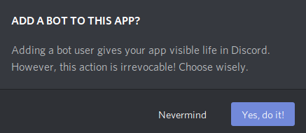

# 環境構築の手順

## 今回使うもの
- Linux
- miniConda
    - Python 3.7.4
- Discord のアカウント

## 手順
1. miniConda のインストール
2. 仮想環境作成

## miniconda のインストール
- まず Linux が 64bit かどうか確認
```
$ getconf LONG_BIT
64 // もしくは 32
```
- [Miniconda](https://docs.conda.io/en/latest/miniconda.html) から **Miniconda Linux 64-bit** をインストール(手動)
- 次に以下のコマンドを実行
```
$ cd Downloads // インストール先に移動
$ bash Miniconda3-latest-Linux-x86_64.sh
Do you accept the license terms? [yes|no]
[no] >>> 
Please answer 'yes' or 'no':'
>>> yes // ライセンス聞かれてるので yes と入力

- Press ENTER to confirm the location
- Press CTRL-C to abort the installation
- Or specify a different location below

// Enter 押してください

/*なんかいろいろばばーって出ます*/

Preparing transaction: done
Executing transaction: done
installation finished.
Do you wish the installer to initialize Miniconda3
by running conda init? [yes|no]
[no] >>> yes //　miniConda を初期化します.
```
- すると Home に miniConda3 がインストールされいます.<br>
本来なら Path まで通すかどうか聞かれるはずなのですが,聞かれなかったので手動で Path 通します
```
$ export PATH=$PATH:$HOME/miniconda3/bin
$ conda -V // PATH 通ってるか確認
conda 4.7.12
```
- これで miniConda3 のインストールは終わりです.
- 参考文献
    - [Ubuntu 18.04にMiniCondaをインストールする](https://codelabo.com/1139/)
    - [Installing on Linux](https://docs.conda.io/projects/conda/en/latest/user-guide/install/linux.html)

## 仮想環境作成
- 仮想環境を作成していきます
```
$ conda create -n 'myVenv' python=3.7 // myVenv は好きな名前に変えておｋです
/*ばばばー*/
The following NEW packages will be INSTALLED:
/*ほにゃらら〜*/
Proceed ([y]/n)? y // 必要なので続行します
$ source activate 'myVenv'
(myVenv) c5019~~ $  // これで仮想環境ができました.
```
- この中では miniConda 内の Python が使用できます
```
(myVenv) $ python -V // この (myVenv) が (base) になってたら source activate 'myVenv' してください
Python 3.7.4
```

## 環境構築
- Discord ChatBot の開発環境を整えていきます.
```
(myVenv) $ pip install discord.py
```
- Discord でテスト用サーバを作成します.
    - グループで共有してもいいですし, 個人ごとにサーバ作ってもいいです.
    - Discord 得知らない方は自分でサーバ作っちゃったほうがいいと思います.<br>
    
    - 新規作成 -> サーバ名入力 -> 新規作成
        - これでサーバが作成できました
        

- Bot 用の TOKEN を取得します.
    - [DiscordのDeveloper](https://discordapp.com/developers/applications/me)サイトで新しい Bot を登録します.<br>
    
    - ChatBot の名前を入力します<br>
    
    - 左側にある Bot の欄に行き Add Bot をクリックしてYes, do it!<br>
    <br>
    <br>
    - TOKEN をコピーしてメモっといてください. のちのち使います
    
    - 最後に左の OAuth2 に移ります.<br>
    OAuth2 URL GRNERATOR の中から "Bot" だけチェックし, 先に移ります.<br>
    そして自分のサーバに追加してください.<br>
    
    
    
    - これで Bot を動かす前準備が全て終わりました.